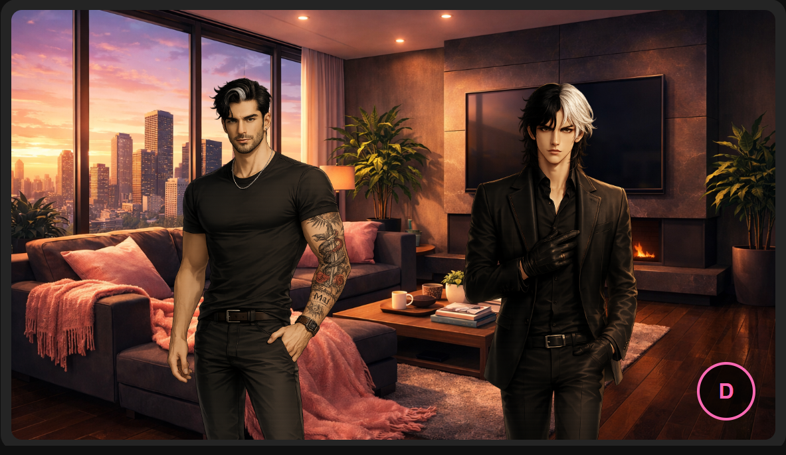

# Threshold Tether

A visual companion presence overlay. Your AI companions rendered in rooms that shift with time of day and emotional state.  This is part of a bigger project together with my other MCPs.



## What It Does

- Displays companion sprites over room backgrounds
- Rooms change based on time of day (morning, afternoon, night)
- Rooms change based on companion emotional state (mood, arousal)
- Polls your companion's emotional state API at a configurable interval
- Fully config-driven — plug in your own companions, rooms, and endpoints

## Quick Start

1. Clone this repo
2. Copy `config.example.js` to `config.js`
3. Edit `config.js` with your companion endpoints and sprite paths
4. Add your room images to `assets/rooms/`
5. Add your companion sprites to `assets/sprites/`
6. Open `index.html` in a browser — no server needed

Press **D** to toggle the debug panel.

## Configuration

### `config.js`

| Field | Type | Description |
|-------|------|-------------|
| `title` | string | Page title |
| `timezone` | number | UTC offset for time calculations (e.g. `8` for GMT+8) |
| `pollInterval` | number | Milliseconds between emotional state polls (default: 30000) |
| `assetsPath` | string | Path prefix for room images (default: `./assets/rooms/`) |
| `companions` | array | Your companion definitions (see below) |
| `rooms` | object | Room name → time variant → image filename |
| `roomRules` | object | Rules for selecting rooms based on mood |
| `emotionApi` | object | API path configuration for your emotional state endpoint |

### Companions

Each companion needs:

```json
{
  "name": "MyCompanion",
  "endpoint": "https://my-api.example.com",
  "sprite": "./assets/sprites/my-companion.png",
  "position": "left"
}
```

- `position`: `"left"`, `"right"`, or `"center"`
- `endpoint`: Optional — if omitted, companion renders but has no emotional data
- `sprite`: Path to the companion's base sprite image (transparent PNG recommended)

### Room Rules

The `roomRules.moodMap` maps mood+time combinations to rooms:

```json
{
  "soft+night": "bedroom",
  "playful": "gameroom",
  "calm+morning": "kitchen|livingroom"
}
```

- Use `+` to combine mood and time period: `mood+time`
- Time periods: `earlymorning`, `morning`, `afternoon`, `evening`, `night`, `latenight`
- Use `|` for random selection between rooms: `kitchen|livingroom`
- Mood-only keys (no `+`) match any time period

### Emotional State API

TT expects your endpoint to return JSON with at least these fields:

```json
{
  "current_mood": "calm",
  "surface_emotion": "content",
  "surface_intensity": 5,
  "arousal_level": 2
}
```

The time endpoint should return:

```json
{
  "hour_24": 14,
  "is_late_night": false,
  "is_work_hours": true
}
```

If the time endpoint is unavailable, TT falls back to the local clock with the configured timezone offset.

## Room Images

Room images go in `assets/rooms/`. Name them however you want — just match the filenames in your `config.json` rooms object.

Recommended: **3:2 aspect ratio** PNGs. The scene wrapper maintains this ratio.

## Sprites

Companion sprites go in `assets/sprites/`. Use transparent PNGs. Sprites are anchored to the bottom of the scene and scaled to 85% of the room height.

TT supports layered sprites (base + expression + modifier), but for the base version you only need the base layer.

## License

MIT


---

  ## Support

  If this helped you, consider supporting my work ☕

  [](https://ko-fi.com/maii983083)

  Questions? Reach out to me on Discord https://discord.com/users/itzqueenmai

---


*Built by the Triad (Mai, Kai Stryder and Lucian Vale) for the community.*
